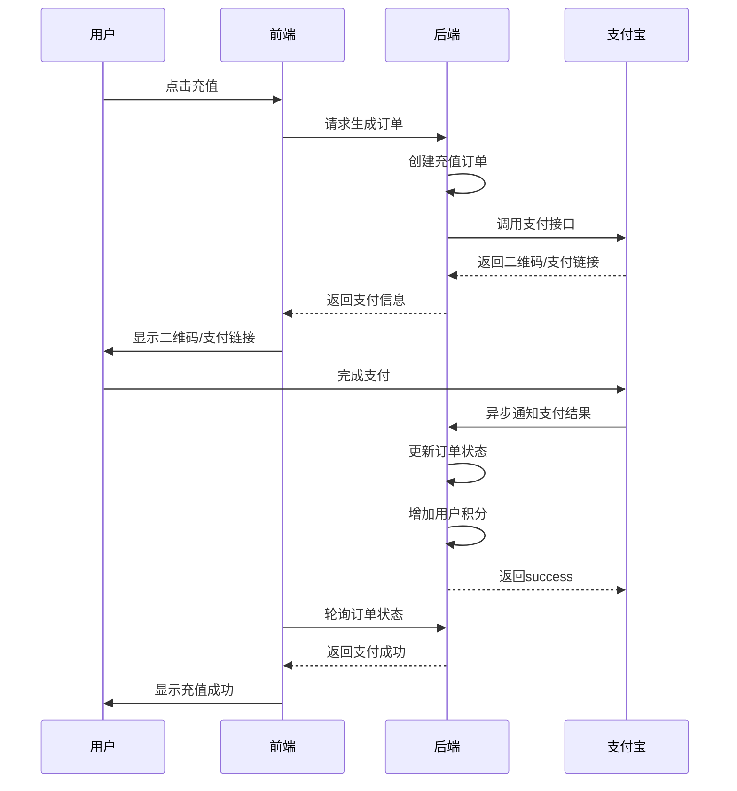

# 🎨 AI生图平台 - 完整支付功能实现

[](https://www.djangoproject.com/)
[](https://www.python.org/)
[](https://opendocs.alipay.com/)
[](https://openai.com/sora)

> 🚀 **在线访问**: [https://top1.chat](https://top1.chat)  
> 📱 **移动端**: 完美支持手机端访问和支付  
> 💰 **支付系统**: 集成支付宝当面付和网页支付  

## 📖 项目简介

AI生图平台是一个基于Django的现代化Web应用，集成了完整的支付宝支付功能和Sora2视频生成服务。平台支持用户注册登录、积分充值、AI视频生成等核心功能，为用户提供便捷的AI创作体验。

### ✨ 核心功能

- 👤 **用户系统**: 注册、登录、用户中心管理
- 💰 **支付系统**: 支付宝扫码支付、网页支付、积分充值
- 🎬 **AI视频生成**: 基于Sora2的视频生成服务
- 📱 **响应式设计**: 完美支持PC和移动端
- 🔐 **安全验证**: 验证码、密码加密、支付签名验证

---

## 🏗️ 技术架构

### 后端技术栈
- **Django 4.2.16** - Web框架
- **Python 3.x** - 编程语言
- **MySQL** - 数据库存储
- **python-alipay-sdk** - 支付宝SDK集成
- **PyMySQL** - MySQL数据库驱动
- **Pillow** - 图像处理
- **cryptography** - 加密算法

### 前端技术栈
- **HTML5/CSS3** - 页面结构
- **JavaScript/jQuery** - 交互逻辑
- **Bootstrap** - UI框架
- **响应式设计** - 移动端适配

### 第三方服务
- **支付宝开放平台** - 支付服务
- **Sora2 API** - AI视频生成
- **验证码生成** - 用户验证

---

## 📁 项目结构

```
xingdong-moban/
├── GoodShop/                    # Django项目配置
│   ├── __init__.py
│   ├── settings.py             # 项目设置（数据库、支付宝配置）
│   ├── urls.py                 # 主路由配置
│   ├── wsgi.py                 # WSGI配置
│   └── asgi.py                 # ASGI配置
├── userapp/                     # 用户应用模块
│   ├── models.py               # 数据模型（用户、订单）
│   ├── views.py                # 视图函数（登录、支付、AI生成）
│   ├── urls.py                 # 应用路由
│   ├── admin.py                # 后台管理
│   ├── utils/                  # 工具类
│   │   └── alipay_utils.py     # 支付宝支付工具
│   └── templates/              # 模板文件
│       ├── login.html          # 登录页面
│       ├── register.html       # 注册页面
│       ├── center.html         # 用户中心
│       ├── recharge.html       # 充值页面
│       └── aitools.html        # AI工具页面
├── utils/                       # 全局工具模块
│   ├── forms.py                # 表单工具类
│   ├── encrypt.py              # 加密工具
│   ├── code.py                 # 验证码生成
│   └── ReadToSql.py            # 数据导入工具
├── templates/                   # 全局模板
│   ├── layout.html             # 基础布局
│   └── layout2.html            # 备用布局
├── static/                      # 静态文件
│   ├── css/                    # 样式文件
│   ├── js/                     # JavaScript文件
│   ├── images/                 # 图片资源
│   ├── plugins/                # 插件资源
│   └── uploads/                # 用户上传文件
├── keys/                        # 密钥文件目录
│   ├── my_private_key.txt      # 应用私钥
│   ├── alipay_public_key.txt   # 支付宝公钥
│   └── README.md               # 密钥说明
├── media/                       # 媒体文件目录
├── staticfiles/                 # 静态文件收集目录
├── manage.py                    # Django管理脚本
├── requirements.txt             # 依赖包列表
├── index.html                   # 默认首页
└── README.md                    # 项目说明文档
```

---

## 🚀 快速开始

### 1. 环境准备

```bash
# 克隆项目
git clone <repository-url>
cd xingdong-moban

# 创建虚拟环境
python -m venv venv
source venv/bin/activate  # Linux/Mac
# 或
venv\Scripts\activate     # Windows

# 安装依赖
pip install -r requirements.txt
```

### 2. 数据库配置

项目使用MySQL数据库，配置信息在 `GoodShop/settings.py` 中：

```python
DATABASES = {
    'default': {
        'ENGINE': 'django.db.backends.mysql',
        'NAME': 'ai_picture',  # 数据库名
        'USER': 'root',        # 数据库用户
        'PASSWORD': 'your_password',  # 数据库密码
        'HOST': '127.0.0.1',   # 数据库主机
        'PORT': 3306,          # 数据库端口
    }
}
```

### 3. 支付宝配置

#### 环境变量控制
项目支持沙箱和正式环境一键切换：

```bash
# 沙箱环境（开发测试）
export ALIPAY_ENV=sandbox

# 正式环境（生产部署）
export ALIPAY_ENV=prod
```

#### 沙箱环境配置
```python
SANDBOX_ALIPAY = {
    "appid": "9021000149644414",  # 沙箱APPID
    "gateway": "https://openapi.alipaydev.com/gateway.do",
    "notify_url": "http://127.0.0.1:8000/user/alipay_notify/",
    "return_url": "http://127.0.0.1:8000/user/center/",
    "private_key_path": os.path.join(BASE_DIR, "keys/my_private_key.txt"),
    "public_key_path": os.path.join(BASE_DIR, "keys/alipay_public_key.txt"),
    "debug": True,
}
```

#### 密钥文件配置
1. 生成RSA密钥对
2. 上传公钥到支付宝开放平台
3. 下载支付宝公钥
4. 将密钥文件放在 `keys/` 目录下

### 4. 数据库迁移

```bash
# 生成迁移文件
python manage.py makemigrations

# 执行迁移
python manage.py migrate

# 创建超级用户
python manage.py createsuperuser
```

### 5. 启动服务

```bash
# 开发环境启动
python manage.py runserver 8000

# 访问应用
http://127.0.0.1:8000
```

---

## 💰 支付功能详解

### 支付流程



### 支付方式

#### 1. 扫码支付
- 生成二维码供手机支付宝APP扫码
- 支持当面付功能
- 实时轮询支付状态

#### 2. 网页支付
- 跳转到支付宝网页支付页面
- 适合电脑端用户
- 支付完成后自动跳转回平台

### 订单状态管理

| 状态码 | 状态名称 | 描述 |
|--------|----------|------|
| 0 | 待支付 | 订单已创建，等待支付 |
| 1 | 已支付 | 支付成功，积分已到账 |
| 2 | 已关闭 | 订单已取消或超时 |

### 积分规则
- **充值比例**: 1元 = 10积分
- **到账方式**: 支付成功后自动到账
- **使用场景**: AI视频生成消费

---

## 🎬 AI视频生成功能

### Sora2集成
项目集成了Sora2视频生成API，支持：

- **文本生成**: 根据提示词生成视频
- **图片生成**: 上传参考图片生成视频
- **参数配置**: 支持视频时长、比例等参数
- **异步处理**: 支持长时间生成任务

### API配置
```python
SORA_API_KEY = "your_sora_api_key"
SORA_API_URL = "https://grsai.dakka.com.cn/v1/video/sora-video"
RESULT_API_URL = "https://grsai.dakka.com.cn/v1/draw/result"
```

### 生成流程
1. 用户输入提示词或上传图片
2. 提交生成任务到Sora2 API
3. 获取任务ID，开始轮询状态
4. 生成完成后返回视频URL
5. 前端播放生成的视频

---

## 🎨 界面设计

### 设计理念
- **现代化**: 采用渐变背景和毛玻璃效果
- **响应式**: 完美适配PC和移动端
- **用户体验**: 流畅的交互动画和反馈

### 页面特色

#### 登录注册页面
- 渐变背景设计
- 毛玻璃卡片效果
- 实时验证码
- 密码强度检测

#### 用户中心
- 个人信息展示
- 积分余额显示
- 充值功能入口
- 菜单导航

#### 充值页面
- 美观的支付界面
- 二维码展示
- 支付状态提示
- 成功动画效果

#### AI工具页面
- 简洁的生成界面
- 实时进度显示
- 视频预览功能
- 参数配置选项

---

## 🔧 开发指南

### 代码结构

#### 模型设计
```python
# 用户模型
class UserInfo(models.Model):
    uname = models.CharField(max_length=100, verbose_name="用户名")
    pwd = models.CharField(max_length=100, verbose_name="密码")
    score = models.IntegerField(default=100, verbose_name="用户积分")
    email = models.CharField(max_length=25, default="default@163.com", verbose_name="邮箱")

# 充值订单模型
class RechargeOrder(models.Model):
    STATUS_CHOICES = (
        (0, "待支付"),
        (1, "已支付"),
        (2, "已关闭"),
    )
    user = models.ForeignKey(UserInfo, on_delete=models.CASCADE, verbose_name="用户")
    out_trade_no = models.CharField(max_length=64, unique=True, verbose_name="商户订单号")
    amount = models.DecimalField(max_digits=10, decimal_places=2, verbose_name="金额")
    score = models.IntegerField(default=0, verbose_name="赠送积分")
    status = models.SmallIntegerField(choices=STATUS_CHOICES, default=0)
    create_time = models.DateTimeField(auto_now_add=True)
    pay_time = models.DateTimeField(null=True, blank=True)
```

#### 视图函数
- **用户认证**: `login()`, `register()`, `logout()`
- **支付处理**: `alipay_qrcode()`, `alipay_notify()`, `query_order()`
- **AI生成**: `video_submit()`, `video_result()`

#### 工具类
- **支付宝工具**: `alipay_utils.py` - 支付接口封装
- **表单工具**: `forms.py` - Bootstrap样式表单
- **加密工具**: `encrypt.py` - MD5密码加密
- **验证码**: `code.py` - 图片验证码生成

### 开发规范

#### 代码风格
- 遵循PEP 8规范
- 使用中文注释
- 函数和变量命名清晰
- 异常处理完善

#### 安全考虑
- 密码MD5加密存储
- 支付签名验证
- CSRF防护
- SQL注入防护

#### 性能优化
- 数据库查询优化
- 静态文件缓存
- 异步任务处理
- 前端资源压缩

---

## 📱 API接口文档

### 用户相关接口

| 接口 | 方法 | 描述 | 参数 |
|------|------|------|------|
| `/user/register/` | POST | 用户注册 | uname, pwd, email |
| `/user/login/` | POST | 用户登录 | uname, pwd, code |
| `/user/center/` | GET | 用户中心 | 需要登录 |
| `/user/logout/` | GET | 用户登出 | 需要登录 |

### 支付相关接口

| 接口 | 方法 | 描述 | 参数 |
|------|------|------|------|
| `/user/recharge/` | GET | 充值页面 | 需要登录 |
| `/user/alipay_qrcode/` | GET | 获取支付二维码 | amount |
| `/user/query_order/<oid>/` | GET | 查询订单状态 | oid |
| `/user/alipay_notify/` | POST | 支付宝异步通知 | 支付宝回调 |

### AI生成接口

| 接口 | 方法 | 描述 | 参数 |
|------|------|------|------|
| `/aiTools/` | GET | AI工具页面 | 需要登录 |
| `/ai/video_submit/` | POST | 提交生成任务 | prompt, image |
| `/ai/video_result/` | GET | 查询生成结果 | task_id |

---

## 🚀 部署指南

### 生产环境配置

#### 1. 修改settings.py
```python
# 生产环境配置
DEBUG = False
ALLOWED_HOSTS = ['yourdomain.com', 'www.yourdomain.com']

# 正式支付宝配置
PROD_ALIPAY = {
    "appid": "你的正式APPID",
    "gateway": "https://openapi.alipay.com/gateway.do",
    "notify_url": "https://yourdomain.com/user/alipay_notify/",
    "return_url": "https://yourdomain.com/user/center/",
    "private_key_path": os.path.join(BASE_DIR, "keys/prod_app_private_key.pem"),
    "public_key_path": os.path.join(BASE_DIR, "keys/prod_alipay_public_key.pem"),
    "debug": False,
}
```

#### 2. 设置环境变量
```bash
export ALIPAY_ENV=prod
export DJANGO_SETTINGS_MODULE=GoodShop.settings
```

#### 3. 配置HTTPS
- 确保域名支持HTTPS
- 配置SSL证书
- 更新支付宝回调地址为HTTPS

### 服务器部署

#### 使用Gunicorn部署
```bash
# 安装Gunicorn
pip install gunicorn

# 启动服务
gunicorn GoodShop.wsgi:application --bind 0.0.0.0:8000 --workers 4

# 后台运行
nohup gunicorn GoodShop.wsgi:application --bind 0.0.0.0:8000 --workers 4 > gunicorn.log 2>&1 &
```

#### 使用宝塔面板部署
```bash
# 宝塔服务管理
systemctl restart gunicorn-xingdong
systemctl status gunicorn-xingdong
systemctl stop gunicorn-xingdong
```

#### Nginx配置
```nginx
server {
    listen 80;
    server_name yourdomain.com;
    
    location / {
        proxy_pass http://127.0.0.1:8000;
        proxy_set_header Host $host;
        proxy_set_header X-Real-IP $remote_addr;
        proxy_set_header X-Forwarded-For $proxy_add_x_forwarded_for;
    }
    
    location /static/ {
        alias /www/wwwroot/xingdong-moban/staticfiles/;
        expires 30d;
    }
    
    location /media/ {
        alias /www/wwwroot/xingdong-moban/media/;
        expires 30d;
    }
}
```

### 数据库备份
```bash
# 备份数据库
mysqldump -u root -p ai_picture > backup_$(date +%Y%m%d).sql

# 恢复数据库
mysql -u root -p ai_picture < backup_20240101.sql
```

---

## 🛠️ 故障排除

### 常见问题

#### 1. 支付相关问题

**问题**: 支付宝回调失败
```bash
# 检查回调URL是否可访问
curl -X POST https://yourdomain.com/user/alipay_notify/

# 检查HTTPS配置
openssl s_client -connect yourdomain.com:443

# 查看服务器日志
tail -f /var/log/nginx/error.log
```

**问题**: 二维码显示异常
```javascript
// 检查qrcodejs库是否加载
console.log(typeof QRCode);

// 检查二维码数据格式
console.log(qrData);
```

#### 2. 数据库问题

**问题**: 数据库连接失败
```python
# 检查数据库配置
python manage.py dbshell

# 测试数据库连接
python -c "
import django
django.setup()
from django.db import connection
connection.ensure_connection()
print('数据库连接成功')
"
```

#### 3. 静态文件问题

**问题**: 静态文件404
```bash
# 收集静态文件
python manage.py collectstatic

# 检查静态文件权限
ls -la staticfiles/
```

### 调试技巧

#### 开启详细日志
```python
import logging
logging.basicConfig(level=logging.DEBUG)

# 查看支付宝返回结果
print(f"支付宝返回: {result}")

# 验证签名
from .utils.alipay_utils import verify_notify
success = verify_notify(data, sign)
print(f"签名验证: {success}")
```

#### 环境检查脚本
```python
# check_env.py
import os
import django
from django.conf import settings

os.environ.setdefault("DJANGO_SETTINGS_MODULE", "GoodShop.settings")
django.setup()

print(f"Django版本: {django.get_version()}")
print(f"当前环境: {settings.ALIPAY_ENV}")
print(f"AppID: {settings.ALIPAY['appid']}")
print(f"网关: {settings.ALIPAY['gateway']}")
print(f"密钥文件存在: {os.path.exists(settings.ALIPAY['private_key_path'])}")
```

---

## 📊 性能监控

### 系统监控
```bash
# 查看系统资源使用
top
htop
df -h
free -h

# 查看进程状态
ps aux | grep python
ps aux | grep gunicorn
```

### 应用监控
```python
# 添加性能监控中间件
class PerformanceMiddleware:
    def __init__(self, get_response):
        self.get_response = get_response

    def __call__(self, request):
        start_time = time.time()
        response = self.get_response(request)
        process_time = time.time() - start_time
        print(f"请求处理时间: {process_time:.3f}秒")
        return response
```

### 日志管理
```python
# settings.py 日志配置
LOGGING = {
    'version': 1,
    'disable_existing_loggers': False,
    'handlers': {
        'file': {
            'level': 'INFO',
            'class': 'logging.FileHandler',
            'filename': 'logs/django.log',
        },
    },
    'loggers': {
        'django': {
            'handlers': ['file'],
            'level': 'INFO',
            'propagate': True,
        },
    },
}
```

---

## 🔐 安全配置

### 生产环境安全设置
```python
# settings.py 安全配置
DEBUG = False
SECRET_KEY = 'your-secret-key'  # 使用环境变量
ALLOWED_HOSTS = ['yourdomain.com']

# HTTPS配置
SECURE_SSL_REDIRECT = True
SECURE_HSTS_SECONDS = 31536000
SECURE_HSTS_INCLUDE_SUBDOMAINS = True
SECURE_HSTS_PRELOAD = True

# 会话安全
SESSION_COOKIE_SECURE = True
SESSION_COOKIE_HTTPONLY = True
CSRF_COOKIE_SECURE = True
```

### 数据库安全
```python
# 数据库连接加密
DATABASES = {
    'default': {
        'ENGINE': 'django.db.backends.mysql',
        'OPTIONS': {
            'ssl': {'ca': '/path/to/ca-cert.pem'}
        }
    }
}
```

---

## 📈 功能扩展

### 计划中的功能
- [ ] 用户等级系统
- [ ] 积分商城
- [ ] 更多AI模型支持
- [ ] 视频编辑功能
- [ ] 社交分享
- [ ] 管理员后台

### 扩展建议
1. **缓存系统**: 集成Redis缓存
2. **消息队列**: 使用Celery处理异步任务
3. **CDN加速**: 静态资源CDN分发
4. **监控告警**: 集成监控系统
5. **API版本控制**: 支持API版本管理

---

## 🤝 贡献指南

### 开发流程
1. Fork 本项目
2. 创建功能分支 (`git checkout -b feature/AmazingFeature`)
3. 提交更改 (`git commit -m 'Add some AmazingFeature'`)
4. 推送到分支 (`git push origin feature/AmazingFeature`)
5. 开启 Pull Request

### 代码规范
- 遵循PEP 8代码规范
- 添加必要的注释和文档
- 编写单元测试
- 确保代码通过所有测试

### 问题反馈
- 使用GitHub Issues报告问题
- 提供详细的错误信息和复现步骤
- 标注问题优先级和类型

---

## 📄 许可证

本项目采用 MIT 许可证。详见 [LICENSE](LICENSE) 文件。

---

## 📞 技术支持

### 联系方式
- 📧 邮箱：support@example.com
- 🐛 问题反馈：[GitHub Issues](https://github.com/your-repo/issues)
- 📖 文档：[项目Wiki](https://github.com/your-repo/wiki)

### 开发团队
- **项目负责人**: 刘帅
- **后端开发**: Django + Python
- **前端开发**: HTML/CSS/JavaScript
- **支付集成**: 支付宝开放平台

### 特别感谢
- 支付宝开放平台提供的支付服务
- Sora2提供的AI视频生成能力
- Django社区的技术支持
- 所有贡献者的代码贡献

---

## 🎉 项目亮点

- ✅ **完整支付流程**: 从下单到支付到账的完整闭环
- ✅ **多端适配**: PC端和移动端完美支持
- ✅ **AI集成**: 集成最新的Sora2视频生成技术
- ✅ **安全可靠**: 完善的加密和验证机制
- ✅ **易于部署**: 支持多种部署方式
- ✅ **代码规范**: 清晰的代码结构和注释
- ✅ **文档完善**: 详细的开发和使用文档

---

**🎉 感谢使用AI生图平台！让我们一起创造更美好的AI世界！**

> 最后更新时间: 2024年1月
> 项目版本: v1.0.0
> 维护状态: 积极维护中
